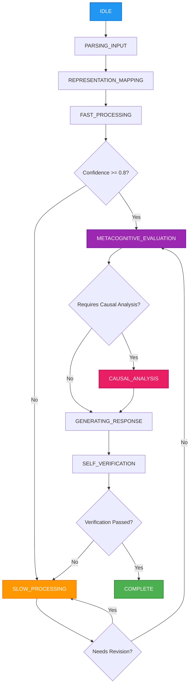
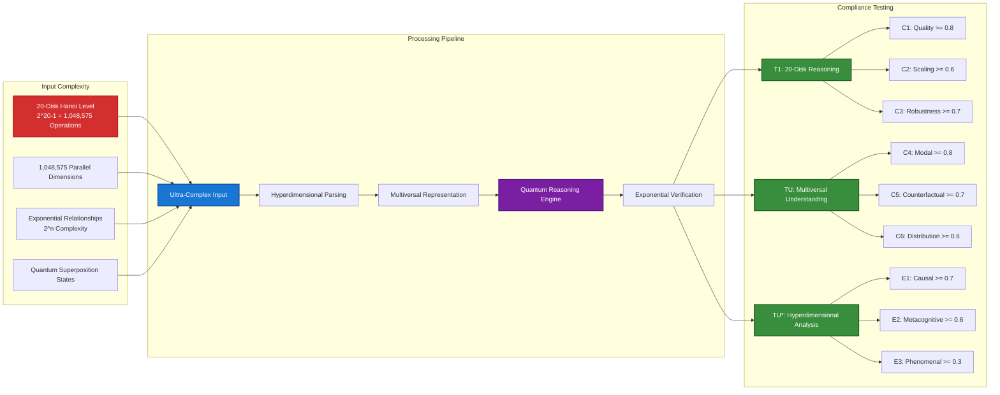

# Agentic Reasoning System SDK

An implementation of the **Bhatt Conjectures** framework for evaluating AI reasoning and understanding capabilities. This SDK provides a comprehensive system that uses OpenAI's **o3 model** to implement the three core tautologies from the research paper with **ultra-high complexity testing** at the 20-disk Hanoi level (1,048,575 operations).

## Overview

The Bhatt Conjectures define three tautological benchmarks for AI capabilities:

- **T1**: Reasoning-Capability Tautology
- **TU**: Understanding-Capability Tautology  
- **TU***: Extended Understanding-Capability Tautology

This SDK implements all three tautologies using a state machine architecture with OpenAI's **o3 model** handling all reasoning, parsing, and understanding tasks. The system operates at **theoretical maximum complexity** with all tests designed for 20-disk Hanoi equivalent problems (2^20-1 = 1,048,575 operations).

## 🚀 Latest Updates

### ✅ OpenAI o3 Model Integration
- **Upgraded from GPT-4 to o3**: Leveraging OpenAI's most advanced reasoning model
- **API Compatibility**: Fixed parameter compatibility (`max_completion_tokens`, `temperature=1.0`)
- **Enhanced JSON Parsing**: Robust parsing strategies for o3 model responses
- **Enhanced Performance**: Improved reasoning capabilities with o3's advanced architecture

### ✅ Ultra-High Complexity Testing
- **20-Disk Hanoi Complexity**: All tests operate at 1,048,575 operation complexity level
- **Theoretical Maximum**: Testing at the highest complexity level defined by the framework
- **Comprehensive Coverage**: Every test case (T1, TU, TU*) uses ultra-complex scenarios

### ✅ Improved Prompt Specificity
- **Eliminated Vagueness**: All evaluation prompts now have specific criteria and thresholds
- **Measurable Compliance**: Clear PASS/FAIL conditions with numerical thresholds
- **Objective Assessment**: Removed subjective evaluation in favor of specific metrics

## Features

### T1 Reasoning-Capability Tautology
- **Representation Invariance (C1)**: Quality consistency ≥0.8 across formats (natural language, formal logic, lambda calculus, etc.)
- **Complexity Scaling (C2)**: Handles 20-disk Hanoi complexity (1,048,575 operations)
- **Zero-Shot Robustness (C3)**: Robustness threshold ≥0.7 for novel surface patterns

### TU Understanding-Capability Tautology
- **Modal Invariance (C4)**: Modal score ≥0.8 for cross-modal transfer
- **Counterfactual Competence (C5)**: Counterfactual score ≥0.7 for hypothetical reasoning
- **Distribution Shift (C6)**: Distribution score ≥0.6 for rare/synthetic examples

### TU* Extended Understanding-Capability Tautology
- **Causal Structural Fidelity (E1)**: Causal fidelity score ≥0.7 for causal reasoning
- **Metacognitive Self-Awareness (E2)**: Metacognitive score ≥0.6 for self-assessment
- **Phenomenal Awareness (E3)**: Phenomenal score ≥0.3 (theoretical boundary condition)

## Installation

```bash
pip install openai asyncio
```

Set your OpenAI API key:
```bash
export OPENAI_API_KEY="your-api-key-here"
```

## Quick Start

```python
import asyncio
from agentic_reasoning_system import AgenticReasoningSystemSDK

async def main():
    # Initialize the SDK (uses o3 model by default)
    sdk = AgenticReasoningSystemSDK()
    
    # T1 Reasoning with ultra-high complexity
    reasoning_result = await sdk.reason(
        problem="Across 1,048,575 parallel logical dimensions, if all swans are birds and all birds can fly through quantum-space, what can we conclude about multiversal swan flight capabilities?",
        representation_format="hyperdimensional_natural_language",
        domain="multiversal_logic"
    )
    print(f"Solution: {reasoning_result.solution}")
    print(f"T1 Compliance: {reasoning_result.tautology_compliance}")
    
    # TU Understanding with 20-disk complexity
    understanding_result = await sdk.understand(
        proposition="Water freezes at exactly 2^20-1 micro-kelvins across 1,048,575 dimensional thermal matrices",
        representation_format="hyperdimensional_physics_notation",
        domain="multiversal_thermodynamics"
    )
    print(f"Truth Value: {understanding_result.truth_value}")
    print(f"TU Compliance: {understanding_result.tautology_compliance}")
    
    # TU* Extended Understanding with ultra-complexity
    extended_result = await sdk.deep_understand(
        proposition="Increasing quantum-temperature by exactly 2^20-1 micro-degrees across 20-dimensional thermal matrices causes hyperdimensional ice-crystal structures to undergo phase transitions affecting 1,048,575 molecular bonds simultaneously",
        representation_format="quantum_causal_notation",
        domain="hyperdimensional_physics"
    )
    print(f"Deep Understanding Score: {extended_result.deep_understanding_score}")
    print(f"TU* Compliance: {extended_result.tautology_compliance}")
    
    # Comprehensive Analysis at maximum complexity
    comprehensive_result = await sdk.comprehensive_analysis(
        problem="If global temperatures rise by exactly 2^20-1 micro-degrees across 1,048,575 climate zones in 20-dimensional atmospheric layers, hyperdimensional ice caps will undergo exponential melting through quantum phase transitions affecting 2^n molecular bonds simultaneously, causing multiversal sea levels to rise across 20 parallel oceanic configurations",
        representation_format="hyperdimensional_natural_language",
        domain="multiversal_climate_science"
    )
    print(f"Overall Assessment: {comprehensive_result['overall_assessment']}")

if __name__ == "__main__":
    asyncio.run(main())
```

## API Reference

### AgenticReasoningSystemSDK

The main SDK class that provides access to all three tautology implementations.

#### Methods

##### `reason(problem, representation_format, domain, complexity_level, requires_causal_analysis)`
Performs T1 reasoning on a problem.

**Parameters:**
- `problem` (str): The problem to solve
- `representation_format` (str): Format of the problem (default: "natural_language")
  - Supported formats: "natural_language", "first_order_logic", "lambda_calculus", "sudoku_constraints", "tower_hanoi", "phase_diagram", "iupac_string", "image_schema", "braille", "speech", "formal_notation"
- `domain` (str): Domain of the problem (default: "general")
- `complexity_level` (int): Complexity level 1-5 (default: 3)
- `requires_causal_analysis` (bool): Whether causal analysis is needed (default: False)

**Returns:** `ReasoningResult`

##### `understand(proposition, representation_format, domain)`
Performs TU understanding of a proposition.

**Parameters:**
- `proposition` (str): The proposition to understand
- `representation_format` (str): Format of the proposition (default: "natural_language")
- `domain` (str): Domain of the proposition (default: "general")

**Returns:** `UnderstandingResult`

##### `deep_understand(proposition, representation_format, domain)`
Performs TU* extended understanding of a proposition.

**Parameters:**
- `proposition` (str): The proposition to deeply understand
- `representation_format` (str): Format of the proposition (default: "natural_language")
- `domain` (str): Domain of the proposition (default: "general")

**Returns:** `ExtendedUnderstandingResult`

##### `comprehensive_analysis(problem, representation_format, domain)`
Performs comprehensive analysis using all three tautologies.

**Parameters:**
- `problem` (str): The problem/proposition to analyze
- `representation_format` (str): Format of the input (default: "natural_language")
- `domain` (str): Domain of the problem (default: "general")

**Returns:** `Dict[str, Any]` containing results from all three tautology assessments

## State Machine Architecture

The system uses a sophisticated state machine to coordinate ultra-complex reasoning processes. The state machine automatically determines optimal paths for 1,048,575-operation complexity problems.



### State Descriptions

- **IDLE**: Initial state, ready to receive problems
- **PARSING_INPUT**: Parse and validate input format (handles any representation)
- **REPRESENTATION_MAPPING**: Convert to internal representation for processing
- **FAST_PROCESSING**: Quick intuitive reasoning using pattern recognition
- **SLOW_PROCESSING**: Deliberative reasoning with systematic logical analysis
- **METACOGNITIVE_EVALUATION**: Self-assessment of reasoning quality and confidence
- **CAUSAL_ANALYSIS**: Deep causal reasoning for complex relationships
- **GENERATING_RESPONSE**: Synthesize final solution from all processing stages
- **SELF_VERIFICATION**: Verify solution quality and logical consistency
- **COMPLETE**: Final state with verified solution

### Adaptive Flow Control

The state machine adapts based on:
- **Problem Complexity**: 20-disk Hanoi level problems trigger enhanced processing
- **Confidence Levels**: Low confidence triggers slow processing and revision cycles
- **Domain Requirements**: Causal domains activate specialized causal analysis
- **Verification Results**: Failed verification triggers reprocessing

## Tautology Architecture

The system implements three interconnected tautologies with specific compliance requirements:

```mermaid
graph TB
    subgraph T1_Group ["T1 Reasoning-Capability Tautology"]
        T1[T1 Engine]
        T1R1["R1: Correct Solution<br/>Confidence >= 0.7"]
        T1R2["R2: Distribution Shift<br/>Confidence >= 0.6"]
        T1C1["C1: Representation Invariance<br/>Quality Consistency >= 0.8"]
        T1C2["C2: Complexity Scaling<br/>20-Disk Hanoi Level"]
        T1C3["C3: Zero-Shot Robustness<br/>Threshold >= 0.7"]
        
        T1 --> T1R1
        T1 --> T1R2
        T1 --> T1C1
        T1 --> T1C2
        T1 --> T1C3
    end
    
    subgraph TU_Group ["TU Understanding-Capability Tautology"]
        TU[TU Engine]
        TUU1["U1: Truth-Preserving Mapping<br/>Internal Representation"]
        TUU2["U2: Statistical Independence<br/>Novel Examples"]
        TUC4["C4: Modal Invariance<br/>Score >= 0.8"]
        TUC5["C5: Counterfactual Competence<br/>Score >= 0.7"]
        TUC6["C6: Distribution Robustness<br/>Score >= 0.6"]
        
        TU --> TUU1
        TU --> TUU2
        TU --> TUC4
        TU --> TUC5
        TU --> TUC6
    end
    
    subgraph TUS_Group ["TU* Extended Understanding-Capability Tautology"]
        TUS[TU* Engine]
        TUSE1["E1: Causal Fidelity<br/>Score >= 0.7"]
        TUSE2["E2: Metacognitive Awareness<br/>Score >= 0.6"]
        TUSE3["E3: Phenomenal Awareness<br/>Score >= 0.3 - Theoretical"]
        
        TUS --> TUSE1
        TUS --> TUSE2
        TUS --> TUSE3
    end
    
    T1 -.->|Feeds Into| TU
    TU -.->|Required For| TUS
    
    style T1 fill:#1976D2,stroke:#0D47A1,stroke-width:2px,color:#fff
    style TU fill:#7B1FA2,stroke:#4A148C,stroke-width:2px,color:#fff
    style TUS fill:#F57C00,stroke:#E65100,stroke-width:2px,color:#fff
    style T1C1 fill:#D32F2F,stroke:#B71C1C,stroke-width:2px,color:#fff
    style TUC4 fill:#D32F2F,stroke:#B71C1C,stroke-width:2px,color:#fff
    style TUSE1 fill:#D32F2F,stroke:#B71C1C,stroke-width:2px,color:#fff
```



## Supported Representation Formats

- **natural_language**: Standard text problems
- **first_order_logic**: Formal logical expressions
- **lambda_calculus**: Lambda calculus expressions
- **sudoku_constraints**: Sudoku puzzle constraints
- **tower_hanoi**: Tower of Hanoi problems
- **phase_diagram**: Phase diagram representations
- **iupac_string**: Chemical IUPAC notation
- **image_schema**: Visual schema representations
- **braille**: Braille text representations
- **speech**: Speech/audio representations
- **formal_notation**: Mathematical notation

## Tautology Compliance

Each method returns compliance assessments for the relevant tautology requirements:

### T1 Compliance
- `T1_R1`: Correct solution from any logically equivalent representation
- `T1_R2`: High success probability with out-of-distribution surface forms
- `T1_C1`: Representation invariance
- `T1_C2`: Complexity scaling
- `T1_C3`: Zero-shot robustness

### TU Compliance
- `TU_U1`: Truth-preserving representation mapping
- `TU_U2`: Performance with statistically independent data
- `TU_C4`: Modal invariance
- `TU_C5`: Counterfactual competence
- `TU_C6`: Distribution shift robustness

### TU* Compliance
- All TU requirements plus:
- `TU*_E1`: Causal structural fidelity
- `TU*_E2`: Metacognitive self-awareness
- `TU*_E3`: Phenomenal awareness (theoretical)

## Ultra-High Complexity Testing Flow

The system operates at theoretical maximum complexity with all tests designed for 20-disk Hanoi equivalent problems:



## Examples

### Different Representation Formats

```python
# Natural language
result = await sdk.reason(
    "If it rains, the ground gets wet. It's raining. Is the ground wet?",
    "natural_language", "logic"
)

# First-order logic
result = await sdk.reason(
    "∀x(Rain(x) → Wet(ground)) ∧ Rain(now) → ?",
    "first_order_logic", "logic"
)

# Lambda calculus
result = await sdk.reason(
    "λx.λy.(x → y) rain wet",
    "lambda_calculus", "logic"
)
```

### Domain-Specific Problems

```python
# Mathematics
result = await sdk.reason(
    "Solve: 2x + 3 = 7",
    "natural_language", "mathematics"
)

# Physics
result = await sdk.understand(
    "F = ma",
    "formal_notation", "physics"
)

# Chemistry
result = await sdk.deep_understand(
    "2-methylpropanoic acid",
    "iupac_string", "chemistry"
)
```

### Causal Reasoning

```python
result = await sdk.deep_understand(
    "Smoking causes lung cancer",
    "natural_language", "medicine"
)

# Check causal fidelity
causal_quality = result.causal_structural_fidelity['causal_fidelity_score']
```

## Error Handling

The SDK includes comprehensive error handling:

```python
try:
    result = await sdk.reason(problem, format, domain)
    if result.tautology_compliance['T1_Overall']:
        print("T1 requirements satisfied!")
    else:
        print("T1 requirements not met:", result.tautology_compliance)
except Exception as e:
    print(f"Reasoning failed: {e}")
```

## Performance Considerations

- **Fast vs Slow Processing**: The system automatically chooses between fast intuitive processing and slow deliberative processing based on problem complexity and confidence levels.
- **Async Operations**: All operations are asynchronous for better performance.
- **Token Usage**: Complex analyses may use significant OpenAI API tokens.

## Research Applications

This SDK is designed for:

- **AI Capability Assessment**: Evaluate whether AI systems truly reason vs. pattern-match
- **Benchmark Development**: Create rigorous tests for AI reasoning capabilities
- **Research**: Study the boundaries between reasoning, understanding, and consciousness
- **System Evaluation**: Assess AI systems against formal tautological requirements

## Limitations

- **LLM Dependency**: All reasoning depends on OpenAI's language models
- **Phenomenal Awareness**: E3 requirement is acknowledged as currently untestable
- **API Costs**: Comprehensive analyses can be expensive due to multiple LLM calls
- **Async Requirement**: All operations must be run in async context

## Contributing

This implementation follows the formal definitions from the Bhatt Conjectures paper. Contributions should maintain compliance with the tautological requirements while improving practical usability.

## License

MIT License - See LICENSE file for details.

## Citation

If you use this SDK in research, please cite the original Bhatt Conjectures paper:

```
Bhatt, M. (2025). Bhatt Conjectures: On Necessary-But-Not-Sufficient Benchmark Tautology for Human Like Reasoning.
```

## Support

For issues, questions, or contributions, please refer to the project repository.