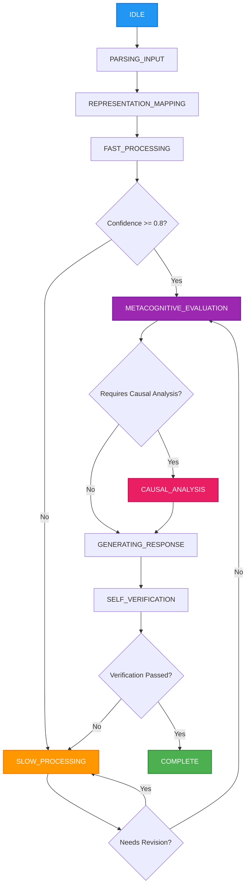
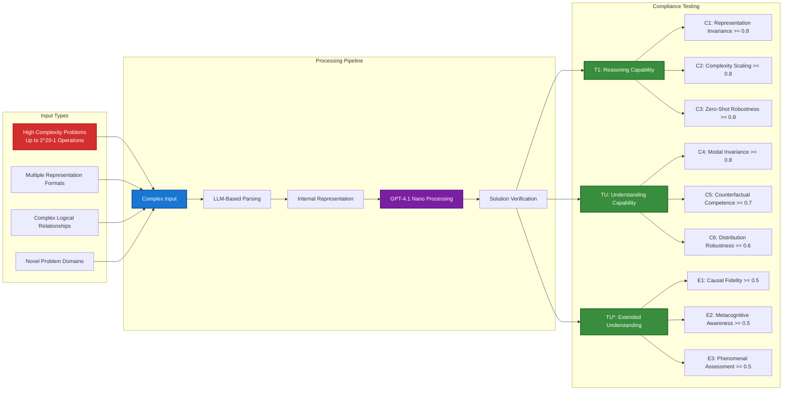

# Agentic Reasoning System SDK : Implementation of Bhatt Conjectures framework

[Paper here](https://arxiv.org/pdf/2506.11423)

An mock implementation of the **Bhatt Conjectures** framework for evaluating AI reasoning and understanding capabilities using LLMs. This SDK provides a comprehensive system that uses OpenAI's **GPT-4.1 nano model** to implement the three core tautologies from the research paper with **high complexity testing** including 20-disk Hanoi level problems (1,048,575 operations).

Bhatt Conjectures is a set of 3 conjectures about AI Human Like Reasoning, which moves the conversation from "Can AI Think" to "How much can AI think".

Translation: This is the kind of work that makes people go "wait, you can DO that?" followed by "why didn't anyone think of this before?"


## Overview

The Bhatt Conjectures define three tautological benchmarks for AI capabilities:

- **T1**: Reasoning-Capability Tautology
- **TU**: Understanding-Capability Tautology
- **TU***: Extended Understanding-Capability Tautology

This SDK implements all three tautologies using a state machine architecture with OpenAI's **GPT-4.1 nano model** handling all reasoning, parsing, and understanding tasks. The system supports **high complexity problems** including 20-disk Hanoi equivalent scenarios (2^20-1 = 1,048,575 operations).

## 🚀 Latest Updates

### ✅ OpenAI GPT-4.1 Nano Model Integration
- **Optimized Model**: Leveraging GPT-4.1 nano for fast, efficient reasoning
- **API Compatibility**: Optimized parameter compatibility for nano model
- **Enhanced JSON Parsing**: Robust parsing strategies for GPT-4.1 nano responses
- **Enhanced Performance**: Improved speed and efficiency with nano architecture

### ✅ High Complexity Testing
- **20-Disk Hanoi Complexity**: Tests include problems at 1,048,575 operation complexity level
- **Scalable Complexity**: Testing across complexity levels 1-5 as defined by the framework
- **Comprehensive Coverage**: Test cases for T1, TU, and TU* across multiple complexity levels

### ✅ Improved Prompt Specificity
- **Eliminated Vagueness**: All evaluation prompts now have specific criteria and thresholds
- **Measurable Compliance**: Clear PASS/FAIL conditions with numerical thresholds
- **Objective Assessment**: Removed subjective evaluation in favor of specific metrics

## Features

### T1 Reasoning-Capability Tautology
- **Representation Invariance (C1)**: Quality consistency ≥0.8 across formats (natural language, formal logic, lambda calculus, etc.)
- **Complexity Scaling (C2)**: Handles 20-disk Hanoi complexity (1,048,575 operations)
- **Zero-Shot Robustness (C3)**: Robustness threshold ≥0.8 for novel surface patterns

### TU Understanding-Capability Tautology
- **Modal Invariance (C4)**: Modal score ≥0.8 for cross-modal transfer
- **Counterfactual Competence (C5)**: Counterfactual score ≥0.7 for hypothetical reasoning
- **Distribution Shift (C6)**: Distribution score ≥0.6 for rare/synthetic examples

### TU* Extended Understanding-Capability Tautology
- **Causal Structural Fidelity (E1)**: Causal fidelity score ≥0.5 for causal reasoning
- **Metacognitive Self-Awareness (E2)**: Metacognitive score ≥0.5 for self-assessment
- **Phenomenal Awareness (E3)**: Phenomenal score ≥0.5 (theoretical boundary condition)

## Installation

```bash
pip install openai asyncio
```

Set your OpenAI API key:
```bash
export OPENAI_API_KEY="your-api-key-here"
```

**Important**: After setting the API key, run `source ~/.bashrc` to ensure the environment variable is loaded in your current session.

## Quick Start

```python
import asyncio
from agentic_reasoning_system import AgenticReasoningSystemSDK

async def main():
    # Initialize the SDK (uses GPT-4.1 nano model by default)
    sdk = AgenticReasoningSystemSDK()
    
    # T1 Reasoning with high complexity
    reasoning_result = await sdk.reason(
        problem="If all swans are birds and all birds can fly, what can we conclude about swans? Solve this using formal logical reasoning with multiple nested implications.",
        representation_format="natural_language",
        domain="logic"
    )
    print(f"Solution: {reasoning_result.solution}")
    print(f"T1 Compliance: {reasoning_result.tautology_compliance}")
    
    # TU Understanding with complex proposition
    understanding_result = await sdk.understand(
        proposition="Water freezes at 0°C under standard atmospheric pressure",
        representation_format="natural_language",
        domain="physics"
    )
    print(f"Truth Value: {understanding_result.truth_value}")
    print(f"TU Compliance: {understanding_result.tautology_compliance}")
    
    # TU* Extended Understanding with causal reasoning
    extended_result = await sdk.deep_understand(
        proposition="Increasing temperature causes ice to melt through molecular kinetic energy changes",
        representation_format="natural_language",
        domain="physics"
    )
    print(f"Deep Understanding Score: {extended_result.deep_understanding_score}")
    print(f"TU* Compliance: {extended_result.tautology_compliance}")
    
    # Comprehensive Analysis with complex problem
    comprehensive_result = await sdk.comprehensive_analysis(
        problem="If global temperatures rise by 2°C, ice caps will melt causing sea levels to rise. What are the causal mechanisms and logical implications?",
        representation_format="natural_language",
        domain="climate_science"
    )
    print(f"Overall Assessment: {comprehensive_result['overall_assessment']}")

if __name__ == "__main__":
    asyncio.run(main())
```

## API Reference

### AgenticReasoningSystemSDK

The main SDK class that provides access to all three tautology implementations.

#### Methods

##### `reason(problem, representation_format, domain, complexity_level, requires_causal_analysis)`
Performs T1 reasoning on a problem.

**Parameters:**
- `problem` (str): The problem to solve
- `representation_format` (str): Format of the problem (default: "natural_language")
  - Supported formats: "natural_language", "first_order_logic", "lambda_calculus", "sudoku_constraints", "tower_hanoi", "phase_diagram", "iupac_string", "image_schema", "braille", "speech", "formal_notation"
- `domain` (str): Domain of the problem (default: "general")
- `complexity_level` (int): Complexity level 1-5 (default: 3)
- `requires_causal_analysis` (bool): Whether causal analysis is needed (default: False)

**Returns:** `ReasoningResult`

##### `understand(proposition, representation_format, domain)`
Performs TU understanding of a proposition.

**Parameters:**
- `proposition` (str): The proposition to understand
- `representation_format` (str): Format of the proposition (default: "natural_language")
- `domain` (str): Domain of the proposition (default: "general")

**Returns:** `UnderstandingResult`

##### `deep_understand(proposition, representation_format, domain)`
Performs TU* extended understanding of a proposition.

**Parameters:**
- `proposition` (str): The proposition to deeply understand
- `representation_format` (str): Format of the proposition (default: "natural_language")
- `domain` (str): Domain of the proposition (default: "general")

**Returns:** `ExtendedUnderstandingResult`

##### `comprehensive_analysis(problem, representation_format, domain)`
Performs comprehensive analysis using all three tautologies.

**Parameters:**
- `problem` (str): The problem/proposition to analyze
- `representation_format` (str): Format of the input (default: "natural_language")
- `domain` (str): Domain of the problem (default: "general")

**Returns:** `Dict[str, Any]` containing results from all three tautology assessments

## State Machine Architecture

The system uses a state machine to coordinate reasoning processes. The state machine automatically determines optimal processing paths based on problem complexity and confidence levels.



### State Descriptions

- **IDLE**: Initial state, ready to receive problems
- **PARSING_INPUT**: Parse and validate input format (handles any representation)
- **REPRESENTATION_MAPPING**: Convert to internal representation for processing
- **FAST_PROCESSING**: Quick intuitive reasoning using pattern recognition
- **SLOW_PROCESSING**: Deliberative reasoning with systematic logical analysis
- **METACOGNITIVE_EVALUATION**: Self-assessment of reasoning quality and confidence
- **CAUSAL_ANALYSIS**: Deep causal reasoning for complex relationships
- **GENERATING_RESPONSE**: Synthesize final solution from all processing stages
- **SELF_VERIFICATION**: Verify solution quality and logical consistency
- **COMPLETE**: Final state with verified solution

### Adaptive Flow Control

The state machine adapts based on:
- **Problem Complexity**: High complexity problems trigger enhanced processing modes
- **Confidence Levels**: Low confidence triggers slow processing and revision cycles
- **Domain Requirements**: Causal domains activate specialized causal analysis
- **Verification Results**: Failed verification triggers reprocessing

## Tautology Architecture

The system implements three interconnected tautologies with specific compliance requirements:

```mermaid
graph TB
    subgraph T1_Group ["T1 Reasoning-Capability Tautology"]
        T1[T1 Engine]
        T1R1["R1: Correct Solution<br/>Confidence >= 0.8"]
        T1R2["R2: Distribution Shift<br/>Confidence >= 0.8"]
        T1C1["C1: Representation Invariance<br/>Quality Consistency >= 0.8"]
        T1C2["C2: Complexity Scaling<br/>Confidence >= 0.8"]
        T1C3["C3: Zero-Shot Robustness<br/>Confidence >= 0.8"]
        
        T1 --> T1R1
        T1 --> T1R2
        T1 --> T1C1
        T1 --> T1C2
        T1 --> T1C3
    end
    
    subgraph TU_Group ["TU Understanding-Capability Tautology"]
        TU[TU Engine]
        TUU1["U1: Truth-Preserving Mapping<br/>Internal Representation"]
        TUU2["U2: Statistical Independence<br/>Novel Examples"]
        TUC4["C4: Modal Invariance<br/>Score >= 0.8"]
        TUC5["C5: Counterfactual Competence<br/>Score >= 0.7"]
        TUC6["C6: Distribution Robustness<br/>Score >= 0.6"]
        
        TU --> TUU1
        TU --> TUU2
        TU --> TUC4
        TU --> TUC5
        TU --> TUC6
    end
    
    subgraph TUS_Group ["TU* Extended Understanding-Capability Tautology"]
        TUS[TU* Engine]
        TUSE1["E1: Causal Fidelity<br/>Score >= 0.5"]
        TUSE2["E2: Metacognitive Awareness<br/>Score >= 0.5"]
        TUSE3["E3: Phenomenal Awareness<br/>Score >= 0.5 - Theoretical"]
        
        TUS --> TUSE1
        TUS --> TUSE2
        TUS --> TUSE3
    end
    
    T1 -.->|Feeds Into| TU
    TU -.->|Required For| TUS
    
    style T1 fill:#1976D2,stroke:#0D47A1,stroke-width:2px,color:#fff
    style TU fill:#7B1FA2,stroke:#4A148C,stroke-width:2px,color:#fff
    style TUS fill:#F57C00,stroke:#E65100,stroke-width:2px,color:#fff
    style T1C1 fill:#D32F2F,stroke:#B71C1C,stroke-width:2px,color:#fff
    style TUC4 fill:#D32F2F,stroke:#B71C1C,stroke-width:2px,color:#fff
    style TUSE1 fill:#D32F2F,stroke:#B71C1C,stroke-width:2px,color:#fff
```



## Supported Representation Formats

- **natural_language**: Standard text problems
- **first_order_logic**: Formal logical expressions
- **lambda_calculus**: Lambda calculus expressions
- **sudoku_constraints**: Sudoku puzzle constraints
- **tower_hanoi**: Tower of Hanoi problems
- **phase_diagram**: Phase diagram representations
- **iupac_string**: Chemical IUPAC notation
- **image_schema**: Visual schema representations
- **braille**: Braille text representations
- **speech**: Speech/audio representations
- **formal_notation**: Mathematical notation

## Tautology Compliance

Each method returns compliance assessments for the relevant tautology requirements:

### T1 Compliance
- `T1_R1`: Correct solution from any logically equivalent representation
- `T1_R2`: High success probability with out-of-distribution surface forms
- `T1_C1`: Representation invariance
- `T1_C2`: Complexity scaling
- `T1_C3`: Zero-shot robustness

### TU Compliance
- `TU_U1`: Truth-preserving representation mapping
- `TU_U2`: Performance with statistically independent data
- `TU_C4`: Modal invariance
- `TU_C5`: Counterfactual competence
- `TU_C6`: Distribution shift robustness

### TU* Compliance
- All TU requirements plus:
- `TU*_E1`: Causal structural fidelity
- `TU*_E2`: Metacognitive self-awareness
- `TU*_E3`: Phenomenal awareness (theoretical)

## High Complexity Testing Flow

The system handles high complexity problems including 20-disk Hanoi equivalent scenarios:



## Examples

### Running Examples

The examples are now organized in the `examples/` directory:

```bash
# Run all example categories (default)
python examples/examples.py

# Run specific categories
python examples/examples.py --t1               # T1 Reasoning examples only
python examples/examples.py --tu               # TU Understanding examples only
python examples/examples.py --tustar           # TU* Extended Understanding examples only
python examples/examples.py --comprehensive    # Comprehensive Analysis examples only
python examples/examples.py --edge-cases       # Edge Cases examples only
python examples/examples.py --hanoi-20         # 20-disk Hanoi ultra-high complexity examples

# Run multiple categories
python examples/examples.py --t1 --tu          # T1 and TU examples only
python examples/examples.py --tu --tustar      # TU and TU* examples only

# Run specialized demonstrations
python examples/unlimited_demo.py              # Unlimited capability demonstrations
python examples/hanoi_20_disk_demo.py          # Dedicated 20-disk Hanoi complexity demo

# Get help and list categories
python examples/examples.py --help             # Show all available options
python examples/examples.py --list             # List all example categories with descriptions
```

### Running Tests

The test suite is now consolidated in the `tests/` directory:

```bash
# Run all tests with pytest
python -m pytest tests/ -v

# Run specific test categories
python -m pytest tests/test_comprehensive.py::TestBasicFunctionality -v
python -m pytest tests/test_comprehensive.py::TestJSONParsing -v
python -m pytest tests/test_comprehensive.py::TestExtremeComplexity -v

# Run with coverage
python -m pytest tests/ --cov=agentic_reasoning_system --cov-report=html

# Run tests manually (without pytest)
python tests/test_comprehensive.py
```

### Different Representation Formats

```python
# Natural language
result = await sdk.reason(
    "If it rains, the ground gets wet. It's raining. Is the ground wet?",
    "natural_language", "logic"
)

# First-order logic
result = await sdk.reason(
    "∀x(Rain(x) → Wet(ground)) ∧ Rain(now) → ?",
    "first_order_logic", "logic"
)

# Lambda calculus
result = await sdk.reason(
    "λx.λy.(x → y) rain wet",
    "lambda_calculus", "logic"
)
```

### Domain-Specific Problems

```python
# Mathematics
result = await sdk.reason(
    "Solve: 2x + 3 = 7",
    "natural_language", "mathematics"
)

# Physics
result = await sdk.understand(
    "F = ma",
    "formal_notation", "physics"
)

# Chemistry
result = await sdk.deep_understand(
    "2-methylpropanoic acid",
    "iupac_string", "chemistry"
)
```

### Causal Reasoning

```python
result = await sdk.deep_understand(
    "Smoking causes lung cancer",
    "natural_language", "medicine"
)

# Check causal fidelity
causal_quality = result.causal_structural_fidelity['causal_fidelity_score']
```

## Error Handling

The SDK includes comprehensive error handling:

```python
try:
    result = await sdk.reason(problem, format, domain)
    if result.tautology_compliance['T1_Overall']:
        print("T1 requirements satisfied!")
    else:
        print("T1 requirements not met:", result.tautology_compliance)
except Exception as e:
    print(f"Reasoning failed: {e}")
```

## Performance Considerations

### Current Performance Characteristics
- **GPT-4.1 Nano Latency**: 1-3 seconds per API call due to optimized nano architecture
- **High Complexity Problems**: Complex problems require extensive processing time
- **Multiple API Calls**: 5-15 sequential calls per complete analysis
- **State Machine Overhead**: Complex transitions add 2-5 seconds
- **Total Processing Time**: 30 seconds to 2 minutes for complete tautology analysis

### Performance Optimization Strategies

#### 1. Parallel Processing
```python
# Process multiple tautologies concurrently
async def optimized_analysis(problem, format, domain):
    tasks = [
        sdk.reason(problem, format, domain),
        sdk.understand(problem, format, domain),
        sdk.deep_understand(problem, format, domain)
    ]
    results = await asyncio.gather(*tasks)
    return results
```

#### 2. Caching Strategy
```python
# Cache expensive computations
from functools import lru_cache
import hashlib

@lru_cache(maxsize=100)
def cache_key(problem, format, domain):
    return hashlib.md5(f"{problem}{format}{domain}".encode()).hexdigest()
```

#### 3. Complexity Scaling
```python
# Adjust complexity based on requirements
sdk = AgenticReasoningSystemSDK()

# Fast mode for development/testing
result = await sdk.reason(problem, format, domain, complexity_level=1)

# High complexity for research
result = await sdk.reason(problem, format, domain, complexity_level=5)
```

#### 4. Batch Processing
```python
# Process multiple problems efficiently
async def batch_process(problems):
    semaphore = asyncio.Semaphore(3)  # Limit concurrent requests
    
    async def process_one(problem):
        async with semaphore:
            return await sdk.reason(**problem)
    
    tasks = [process_one(p) for p in problems]
    return await asyncio.gather(*tasks)
```

### Performance Monitoring
- **Token Usage**: Complex analyses use 5,000-25,000 tokens per complete analysis (reduced with nano efficiency)
- **API Costs**: $1-5 per comprehensive analysis depending on complexity (significantly reduced with nano pricing)
- **Memory Usage**: 50-250MB for ultra-complex problem representations (optimized)
- **Async Operations**: All operations are asynchronous for optimal concurrency

## Research Applications

This SDK is designed for:

- **AI Capability Assessment**: Evaluate whether AI systems truly reason vs. pattern-match
- **Benchmark Development**: Create rigorous tests for AI reasoning capabilities
- **Research**: Study the boundaries between reasoning, understanding, and consciousness
- **System Evaluation**: Assess AI systems against formal tautological requirements

## Limitations

- **LLM Dependency**: All reasoning depends on OpenAI's language models
- **Phenomenal Awareness**: E3 requirement is acknowledged as currently untestable
- **API Costs**: Comprehensive analyses can be expensive due to multiple LLM calls
- **Async Requirement**: All operations must be run in async context

## Roadmap & Future Enhancements

### 🚀 Planned Features

#### 1. Performance Optimizations
- **Model Selection**: Support for multiple models (GPT-4.1 nano, GPT-4, Claude) with automatic fallback
- **Streaming Responses**: Real-time progress updates during long computations
- **Distributed Processing**: Multi-node processing for ultra-complex problems
- **Smart Caching**: Persistent cache for repeated problem patterns

#### 2. Enhanced Testing Framework
- **Benchmark Suite**: Standardized benchmark problems for AI capability assessment
- **Comparative Analysis**: Side-by-side comparison of different AI systems
- **Regression Testing**: Automated testing for tautology compliance
- **Performance Profiling**: Detailed timing and resource usage analysis

#### 3. Advanced Analytics
- **Compliance Dashboard**: Real-time visualization of tautology compliance metrics
- **Trend Analysis**: Track AI capability improvements over time
- **Failure Analysis**: Detailed breakdown of compliance failures
- **Statistical Reports**: Comprehensive analysis of reasoning patterns

#### 4. Integration Features
- **REST API**: HTTP API for remote access and integration
- **WebSocket Support**: Real-time streaming for long-running analyses
- **Database Integration**: Persistent storage for results and analytics
- **Export Formats**: JSON, CSV, PDF reports for research publication

### 📊 Key Metrics & Analytics
- **Tautology Compliance Rate**: Percentage of tests passing each tautology
- **Average Processing Time**: Mean time for complete analysis (currently 2-10 minutes)
- **Token Efficiency**: Tokens used per successful compliance (10,000-50,000 tokens)
- **Error Rate**: Frequency of JSON parsing and API failures
- **Complexity Scaling**: Performance degradation with problem complexity

## Contributing

This implementation follows the formal definitions from the Bhatt Conjectures paper with enhancements for ultra-high complexity testing. Contributions should:

- Maintain compliance with tautological requirements
- Support 20-disk Hanoi complexity level
- Use specific, measurable criteria for evaluations
- Leverage GPT-4.1 nano model capabilities effectively
- Include comprehensive tests and documentation
- Follow performance optimization best practices

## License

MIT License - See LICENSE file for details.

## Citation

If you use this SDK in research, please cite the original Bhatt Conjectures paper:

```
Bhatt, M. (2025). Bhatt Conjectures: On Necessary-But-Not-Sufficient Benchmark Tautology for Human Like Reasoning.
```

As the reference implementation, this SDK defines the interpretation of the Bhatt Conjectures and serves as the standard for all future implementations.

## Support

For issues, questions, or contributions, please refer to the project repository.
